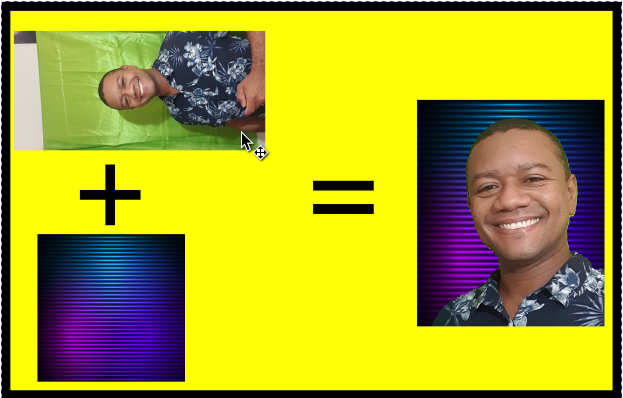

# Remove Background

A command line tool to remove background form an image, or add a new background.

## Objective

When creating thumbnails for my youtube videos, I faced the need to take shots and extract only faces on foreground. Doing this with a lot of files take a long time which may be used in other tasks. Then I decided to automate the most I can using Python (then create the souce code used in a new video!)

To reach my objective, I created a command line job based on this jupyter notebook from [data-flair](https://data-flair.training/blogs/python-remove-image-background/). But instead of processing from webcam, I will process from a saved image on disk.


## Example

The following example shows how an image is rotated, croped for the bounds of a face and merged with a background.



## Instalation

To use, clone this project or download the latest stable release on the [release page](https://github.com/andreclaudino/remove-background/releases). Then you can install it as any Python software using

```SHELL
pip3 install -e <download folder>
```

Or you can install it directly from github:

```SHELL
pip install git+https://git@github.com/andreclaudino/remove-background@stable
```

or using SSH authorization:

```SHELL
pip install git+ssh://git@github.com/andreclaudino/remove-background@stable
```

## How to use

This is a command line tool, there are the parameters:

```
remove-background --help
Usage: remove-background [OPTIONS]

Options:
  -s, --foreground-source-path TEXT
                                  The source path for the image containing the
                                  foreground face
  -b, --background-source-path TEXT
                                  The background image source path. If
                                  ignored, the resulting background will be
                                  transparent.
  -o, --output-path TEXT          The output path for each image
  -f, --output-format [png|webp|hdr|jpg|bmp]
                                  The output file format (file type) of the
                                  generated image
  --threshold FLOAT               Mask extraction threshold
  -h, --output-height INTEGER     The height of the output image. If ignored,
                                  will be calculated.
  -w, --output-width INTEGER      The width of the output image. If ignored,
                                  will be calculated.
  --keep-ratio BOOLEAN            Keep aspect ration on resize
  -r, --rotation INTEGER          Rotate image by this angle clockwise
  --face-xml-model TEXT           The path or URL to XML cascade model used to
                                  detect faces.
  --face-top-offset INTEGER       Top offset for face bounding box in px
  --face-bottom-offset INTEGER    Bottom offset for face bounding box in px
  --face-right-offset INTEGER     Right offset for face bounding box in px
  --face-left-offset INTEGER      Left offset for face bounding box in px
  --help                          Show this message and exi
```